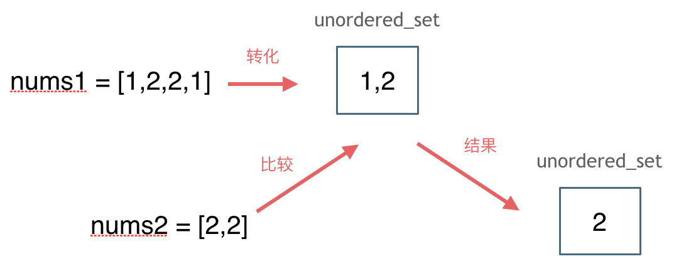

## 题目
[349两个数组的交集](https://leetcode-cn.com/problems/intersection-of-two-arrays/)
给定两个数组 nums1 和 nums2 ，返回 它们的交集 。输出结果中的每个元素一定是 唯一 的。可以不考虑输出结果的顺序 。

示例 1：
输入：nums1 = [1,2,2,1], nums2 = [2,2]
输出：[2]
## 思路
注意：**使用数组来做哈希的题目，是因为题目限制了数值的大小。**而这道题目没有限制数值的大小，就无法使用数组来做哈希表了。
std::unordered_set的底层实现是哈希表， 使用unordered_set 读写效率是最高的，并不需要对数据进行排序，而且还不要让数据重复，所以选择unordered_set。

```cpp
class Solution
{
public:
    vector<int> intersection(vector<int> &nums1, vector<int> &nums2)
    {
        unordered_set<int> result_set; // 存放结果
        unordered_set<int> nums_set(nums1.begin(), nums1.end());
        for (int num : nums2)
        {
            // 发现nums2的元素 在nums_set里又出现过
            if (nums_set.find(num) != nums_set.end())
            {
                result_set.insert(num);
            }
        }
        return vector<int>(result_set.begin(), result_set.end());
    }
};
```
