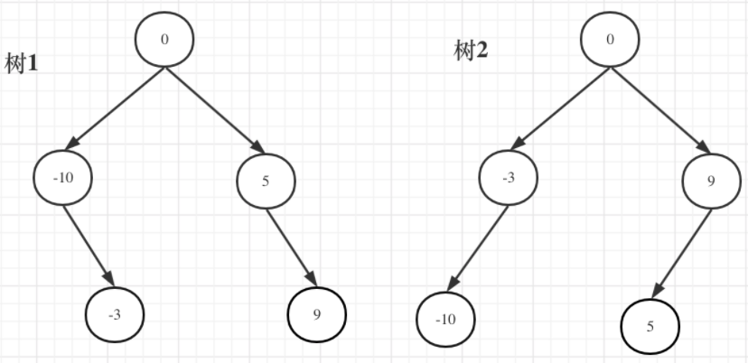

## 题目
[108 将升序数组转换为二叉树](https://leetcode-cn.com/problems/convert-sorted-array-to-binary-search-tree/)
给你一个整数数组 nums ，其中元素已经按 升序 排列，请你将其转换为一棵 高度平衡 二叉搜索树。
高度平衡二叉树是一棵满足「每个节点的左右两个子树的高度差的绝对值不超过 1 」的二叉树。


## 思路
其实这里不用强调平衡二叉搜索树，数组构造二叉树，构成平衡树是自然而然的事情，因为大家默认都是从数组中间位置取值作为节点元素，一般不会随机取。
本题**本质就是寻找分割点，分割点作为当前节点，然后递归左区间和右区间。**本体输出结果不唯一，如果要分割的数组长度为偶数的时候，中间元素为两个，是取左边元素就是树1，取右边元素就是树2。

```cpp
class Solution
{
public:
    TreeNode *sortedArrayToBST(vector<int> &nums)
    {
        return buildAVL(nums, 0, nums.size() - 1);
    }

private:
    TreeNode *buildAVL(vector<int> &nums, int left, int right)
    {
        if (left > right)
            return nullptr;
        else if (left == right)
            return new TreeNode(nums[left]);

        int mid = (left + right) / 2; //默认取左边元素，生成树1
        //int mid = ((left + right) % 2 == 0) ? (left + right) / 2: (left + right) / 2+1; //生成树2
        TreeNode *node = new TreeNode(nums[mid]);
        node->left = buildAVL(nums, left, mid - 1);
        node->right = buildAVL(nums, mid + 1, right);
        return node;
    }
};
```
