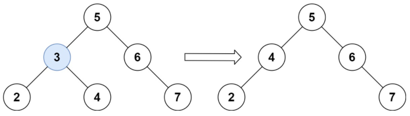

## 题目
[450 删除二叉搜索树中的节点](https://leetcode-cn.com/problems/delete-node-in-a-bst/)
给定一个二叉搜索树的根节点 root 和一个值 key，删除二叉搜索树中的 key 对应的节点，并保证二叉搜索树的性质不变。返回二叉搜索树（有可能被更新）的根节点的引用

## 思路
递归三部曲

- 确定递归函数返回值以及参数：`TreeNode *deleteNode(TreeNode *root, int key)`
- 确定终止条件：没找到删除的节点即遍历到空节点，直接返回（第一种情况）
- 确定单层递归逻辑：
   - 根据当前val与key的大小关系，继续遍历左右子树
   - 找到删除的节点
      - 第二种情况：左右孩子都为空，直接删除节点， 返回null
      - 第三种情况：删除节点的左孩子为空，右孩子不为空，删除节点，右孩子补位，返回右孩子为根节点
      - 第四种情况：删除节点的右孩子为空，左孩子不为空，删除节点，左孩子补位，返回左孩子为根节点
      - 第五种情况：左右孩子节点都不为空，则将删除节点的左子树头结点（左孩子）放到删除节点的右子树的最左面节点的左孩子上，返回删除节点右孩子为新的根节点。**原因：根据二叉搜索树的特性，当前节点左子树的所有值肯定比右子树的都小，所以当root->right作为新的根节点时，左子树只能位于新二叉树的最左侧。**
```cpp
class Solution
{
public:
    TreeNode *deleteNode(TreeNode *root, int key)
    {
        if (root == nullptr)
            return root; // 第一种情况：没找到删除的节点，遍历到空节点直接返回了
        if (root->val == key)
        {
            // 第二种情况：左右孩子都为空（叶子节点），直接删除节点， 返回NULL为根节点
            if (root->left == nullptr && root->right == nullptr)
            {
                ///! 内存释放
                delete root;
                return nullptr;
            }
            // 第三种情况：其左孩子为空，右孩子不为空，删除节点，右孩子补位 ，返回右孩子为根节点
            else if (root->left == nullptr)
            {
                TreeNode *retNode = root->right;
                ///! 内存释放
                delete root;
                return retNode;
            }
            // 第四种情况：其右孩子为空，左孩子不为空，删除节点，左孩子补位，返回左孩子为根节点
            else if (root->right == nullptr)
            {
                TreeNode *retNode = root->left;
                ///! 内存释放
                delete root;
                return retNode;
            }
            // 第五种情况：左右孩子节点都不为空，则将删除节点的左子树放到删除节点的右子树的最左面节点的左孩子的位置
            // 并返回删除节点右孩子为新的根节点。
            else
            {
                TreeNode *cur = root->right; // 找右子树最左面的节点
                while (cur->left != nullptr)
                {
                    cur = cur->left;
                }
                cur->left = root->left; // 把要删除的节点（root）左子树放在cur的左孩子的位置
                TreeNode *tmp = root;   // 把root节点保存一下，下面来删除
                root = root->right;     // 返回旧root的右孩子作为新root
                delete tmp;             // 释放节点内存
                return root;
            }
        }
        if (root->val > key)
            root->left = deleteNode(root->left, key);
        if (root->val < key)
            root->right = deleteNode(root->right, key);
        return root;
    }
};
```
