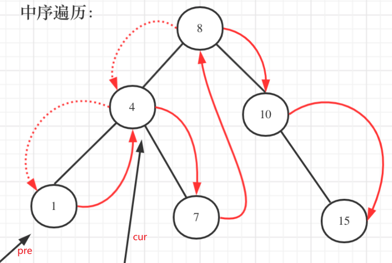

## 题目
[530 二叉搜索树的最小绝对差](https://leetcode-cn.com/problems/minimum-absolute-difference-in-bst/submissions/)
给你一个二叉搜索树的根节点 root ，返回 树中任意两不同节点值之间的最小差值 。
差值是一个正数，其数值等于两值之差的绝对值。
## 思路
首先和leetcode98一样，我们首先想到的是用**中序遍历**获取节点所有的值，然后遍历有序数组进行计算。
其实在二叉搜素树中序遍历的过程中，我们就可以直接计算了。本题我们使用另一种方式：还是用中序遍历，用两个指针直接在遍历过程中计算：

其实很想双指针，不过要注意的是**由于是递归，pre指针必须在递归函数外，不然无法记录前一地址**：
```cpp
class Solution
{
private:
    int result = INT_MAX;
    TreeNode *pre;

    void traversal(TreeNode *cur)
    {
        if (cur == NULL)
            return;
        traversal(cur->left); // 左
        if (pre != NULL)
        { // 中
            //直接减法，一定是正数
            result = min(result, cur->val - pre->val);
        }
        pre = cur;             // 记录前一个
        traversal(cur->right); // 右
    }

public:
    int getMinimumDifference(TreeNode *root)
    {
        traversal(root);
        return result;
    }
};
```
