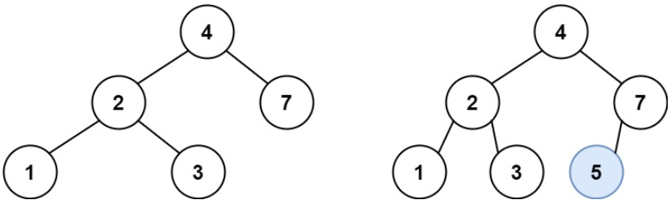

## 题目
[701 二叉搜索树的插入操作](https://leetcode-cn.com/problems/insert-into-a-binary-search-tree/)
给定二叉搜索树（BST）的根节点 root 和要插入树中的值 value ，将值插入二叉搜索树。 返回插入后二叉搜索树的根节点。 输入数据保证 ，新值和原始二叉搜索树中的任意节点值都不同。

注意，可能存在多种有效的插入方式，只要树在插入后仍保持为二叉搜索树即可。 你可以返回任意有效的结果

## 思路
根据二叉搜索树的特点，不断比较节点的值递归查找左右子树，直到找到空节点插入元素就可以了

- 如果val比当前节点值小，继续递归左子树
- 如果val比当前节点值大，继续递归右子树
- 当递归当前节点为空，创建新Node返回
- 递归函数返回值完成了新加入节点的父子关系赋值操作，下一层将加入节点返回，本层用root->left或者root->right将其接住
```cpp
class Solution
{
public:
    TreeNode *insertIntoBST(TreeNode *root, int val)
    {
        if (root == nullptr)
            return new TreeNode(val);
        if (root->val > val)
            root->left = insertIntoBST(root->left, val);
        else
            root->right = insertIntoBST(root->right, val);

        return root;
    }
};
```

