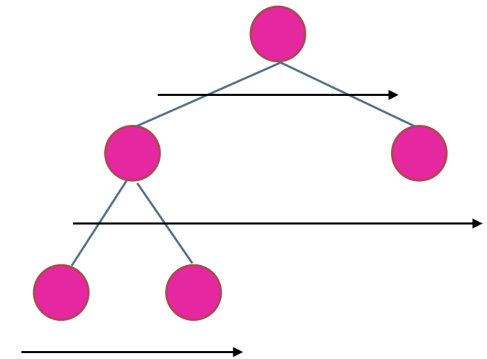

## 题目
[104 二叉树的最大深度](https://leetcode-cn.com/problems/maximum-depth-of-binary-tree/submissions/)
给定一个二叉树，找出其最大深度。
二叉树的深度为根节点到最远叶子节点的最长路径上的节点数。

示例：
如下二叉树深度为3
```
   3
   / \
  9  20
    /  \
   15   7
```
## 思路
使用层序遍历是最为合适的，因为最大的深度就是二叉树的层数，和层序遍历的方式极其吻合。

所以只需要进行层序遍历，并在遍历时count++即可
```cpp
class Solution
{
public:
    int maxDepth(TreeNode *root)
    {
        if (root == nullptr)
            return 0;

        std::queue<TreeNode *> que;
        que.push(root);
        int count = 0;
        while (!que.empty())
        {
            int size = que.size();
            for (int i = 0; i < size; i++)
            {
                TreeNode *node = que.front();
                que.pop();

                if (node->left != nullptr)
                    que.push(node->left);
                if (node->right != nullptr)
                    que.push(node->right);
            }
            count++;
        }
        return count;
    }
};
```
## leetcode 559
559题目也是求最大深度，不同的是给出的不是二叉树，而是多叉树，left和right被`vector<node*>`代替。
写code时只需要遍历`vector<node*>`即可：
```cpp
/*
// Definition for a Node.
class Node {
public:
    int val;
    vector<Node*> children;

    Node() {}

    Node(int _val) {
        val = _val;
    }

    Node(int _val, vector<Node*> _children) {
        val = _val;
        children = _children;
    }
};
*/
class Solution
{
public:
    int maxDepth(Node *root)
    {
        if (root == nullptr)
            return 0;

        std::queue<Node *> que;
        que.push(root);
        int count = 0;
        while (!que.empty())
        {
            int size = que.size();
            for (int i = 0; i < size; i++)
            {
                Node *node = que.front();
                que.pop();

                for (auto n : node->children)
                {
                    que.push(n);
                }
            }
            count++;
        }
        return count;
    }
};
```
