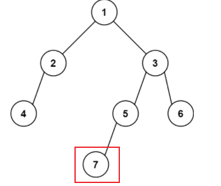

## 题目
[513 找树左下角的值](https://leetcode-cn.com/problems/find-bottom-left-tree-value/)
给定一个二叉树的 根节点 root，请找出该二叉树的** 最底层 最左边 **节点的值。

## 思路
本地要找出树的最后一行找到最左边的值。此时大家应该想起用层序遍历是非常简单的了，只需要记录最后一行第一个节点的数值就可以了。反而用递归的话会比较难一点（**需要递归+回溯寻找最后一层）**。
```cpp
class Solution
{
public:
    int findBottomLeftValue(TreeNode *root)
    {
        std::queue<TreeNode *> que;
        if (root != NULL)
            que.push(root);

        TreeNode *tmp = nullptr;

        while (!que.empty())
        {
            int size = que.size();
            // 这里一定要使用固定大小size，不要使用que.size()，因为que.size是不断变化的
            for (int i = 0; i < size; i++)
            {
                TreeNode *node = que.front();
                que.pop();
                if (i == 0)
                    tmp = node;//指保存一下每层遍历时第一个节点

                if (node->left)
                    que.push(node->left);
                if (node->right)
                    que.push(node->right);
            }
        }
        return tmp->val;//遍历结束,tmp保存的最后一层第一个节点
    }
};
```
