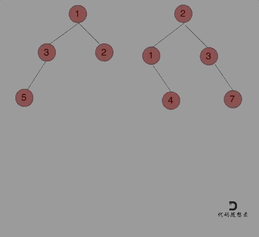

## 题目
[617 合并二叉树](https://leetcode-cn.com/problems/merge-two-binary-trees/)
给你两棵二叉树： root1 和 root2 。
想象一下，当你将其中一棵覆盖到另一棵之上时，两棵树上的一些节点将会重叠（而另一些不会）。你需要将这两棵树合并成一棵新二叉树。合并的规则是：如果两个节点重叠，那么将这两个节点的值相加作为合并后节点的新值；否则，不为 null 的节点将直接作为新二叉树的节点。
返回合并后的二叉树。

## 思路
本题其实和遍历一个树逻辑是一样的，只不过传入两个树的节点，同时操作：

遍历的顺序前中后都可以，下面确定递归的条件

1. **确定递归函数的参数和返回值**：
   1. 首先那么要合入两个二叉树，那么参数至少是要传入两个二叉树的根节点，返回值就是合并之后二叉树的根节点：`TreeNode* mergeTrees(TreeNode* t1, TreeNode* t2) `
2. **确定终止条件**：
   1. 如果t1 == NULL，两个树合并就应该是 t2（如果t2也为NULL也无所谓，合并之后就是NULL）
   1. 如果t2 == NULL，那么两个数合并就是t1（如果t1也为NULL也无所谓，合并之后就是NULL）
3. **确定单层递归的逻辑**：假设t1就是合并之后树的根节点（就是修改了原来树的结构）。那么单层递归中，就要把两棵树的元素加到一起。
```cpp
class Solution
{
public:
    TreeNode *mergeTrees(TreeNode *t1, TreeNode *t2)
    {
        if (t1 == NULL)
            return t2; // 如果t1为空，合并之后就应该是t2
        if (t2 == NULL)
            return t1; // 如果t2为空，合并之后就应该是t1
        // 修改了t1的数值和结构
        t1->val += t2->val;                           // 中
        t1->left = mergeTrees(t1->left, t2->left);    // 左
        t1->right = mergeTrees(t1->right, t2->right); // 右
        return t1;
    }
};
```
