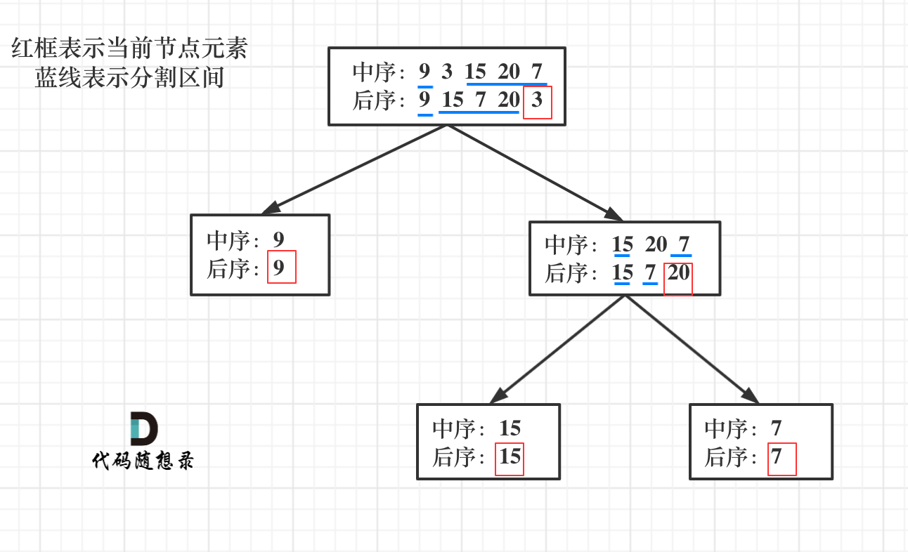

## 中序和后续数组构建
[106 从中序和后续遍历序列构建二叉树](https://leetcode-cn.com/problems/construct-binary-tree-from-inorder-and-postorder-traversal/)

如图，**后序遍历数组的最后一个元素就是二叉树的root节点**，所以解题思路为以后序数组的最后一个元素为切割点，先切中序数组，根据中序数组，反过来在切后序数组。一层一层切下去，每次后序数组最后一个元素就是节点元素。
具体步骤为：

- 第一步：如果数组大小为零的话，说明是空节点了。
- 第二步：如果不为空，那么取后序数组最后一个元素作为root节点元素。
- 第三步：如果数组size为1，则只要root节点，直接返回
- 第三步：找到root节点在中序数组的位置，作为切割点
- 第四步：**切割中序数组，切成中序左数组和中序右数组（左子树和右子树）**
- 第五步：**根据中续左数组的size切割后序数组，切成后序左数组和后序右数组**，因为不同遍历顺序不影响节点个数，两种遍历方式左子树的节点个数相同。注意将后续数组最后一个排除
- 第六步：递归处理左区间和右区间
```cpp
class Solution
{
public:
    TreeNode *buildTree(vector<int> &inorder, vector<int> &postorder)
    {
        if (inorder.size() == 0)
            return nullptr;

        //后序遍历的最后一个是root节点
        int val = postorder.back();
        TreeNode *root = new TreeNode(val);
        if (inorder.size() == 1)
            return root; //如果只有一个节点,返回

        //查找在中序遍历中头节点位置,分割inorder
        auto pos = std::find(inorder.begin(), inorder.end(), val);
        vector<int>inLeft(inorder.begin(), pos);
        vector<int>inRight(pos + 1, inorder.end()); //略过pos位置的头节点

        // postorder 舍弃末尾元素
        postorder.resize(postorder.size() - 1);

        //根据inLeft的size,切割postorder(不同遍历顺序不影响节点个数,左子树的节点个数相同)
        vector<int> postLeft(postorder.begin(), postorder.begin() + inLeft.size());
        vector<int> postRight(postorder.begin() + inLeft.size(), postorder.end());

        //设置当前节点的左右子节点
        root->left = buildTree(inLeft, postLeft);
        root->right = buildTree(inRight, postRight);

        return root;
    }
};
```
## 前序和中序数组构建
[105 从前序和中序序列构建二叉树](https://leetcode-cn.com/problems/construct-binary-tree-from-preorder-and-inorder-traversal/)
前序遍历数组的第一个元素是二叉树的root节点，找到root节点就可以采取类似的处理逻辑：
具体步骤为：

- 第一步：如果数组大小为零的话，说明是空节点了。
- 第二步：如果不为空，那么取前序数组第一个元素作为root节点元素。
- 第三步：如果数组size为1，则只要root节点，直接返回
- 第三步：找到root节点在中序数组的位置，作为切割点
- 第四步：**切割中序数组，切成中序左数组和中序右数组（左子树和右子树）**
- 第五步：**根据中续左数组的size切割前序数组，切成前序左数组和前序右数组**，因为不同遍历顺序不影响节点个数，两种遍历方式左子树的节点个数相同。注意前序数组第一个元素要排除
- 第六步：递归处理左区间和右区间
```cpp
class Solution
{
public:
    TreeNode *buildTree(vector<int> &preorder, vector<int> &inorder)
    {
        if (inorder.size() == 0)
            return nullptr;

        //前序遍历的第一个是root节点
        int val = preorder[0];
        TreeNode *root = new TreeNode(val);
        if (inorder.size() == 1)
            return root; //如果只有一个节点,返回

        //查找在中序遍历中头节点位置,分割inorder
        auto pos = std::find(inorder.begin(), inorder.end(), val);
        vector<int> inLeft, inRight;
        inLeft.assign(inorder.begin(), pos);
        inRight.assign(pos + 1, inorder.end()); //略过pos位置的头节点

        //根据inLeft的size,切割preorder(不同遍历顺序不影响节点个数,左子树的节点个数相同)
        //注意掠过第一个元素
        vector<int> preLeft(preorder.begin() + 1, preorder.begin() + 1 + inLeft.size());
        vector<int> preRight(preorder.begin() + 1 + inLeft.size(), preorder.end());

        //设置当前节点的左右子节点
        root->left = buildTree(preLeft, inLeft);
        root->right = buildTree(preRight, inRight);

        return root;
    }
};
```
