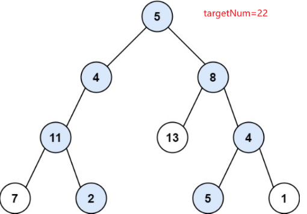

## 题目
[113 路径总和II](https://leetcode-cn.com/problems/path-sum-ii/)
给你二叉树的根节点 root 和一个整数目标和 targetSum ，找出所有 从根节点到叶子节点 路径总和等于给定目标和的路径。

## 思路
本题和leetcode257基本一样，257是求每条路径，本题只要找到路径上总和与target相等的路径即可，比257多了比较的操作。
遍历整个树，找到所有路径，所以递归函数不要返回值（返回值只能返回一个），要用返回参数！

解题代码如下，和257基本一样：
```cpp
class Solution
{
public:
    vector<vector<int>> pathSum(TreeNode *root, int targetSum)
    {
        vector<int> path;
        vector<vector<int>> result;
        getPaths(root, targetSum, path, result);
        return result;
    }

private:
    void getPaths(TreeNode *node, int target, vector<int> &path, vector<vector<int>> &result)
    {
        if (node == nullptr)
            return;

        path.push_back(node->val);
        //判断当前节点是否是叶子节点
        if (node->left == nullptr && node->right == nullptr)
        {
            int sum = 0;
            for (auto p : path)
            {
                sum += p;
            }
            if (sum == target)//判断和是否相等
                result.push_back(path);
            return;
        }
        //不是叶子节点，分别遍历其左子树和右子树
        if (node->left != nullptr)
        {
            getPaths(node->left, target, path, result);
            path.pop_back(); //回溯，移除node->left
        }
        if (node->right != nullptr)
        {
            getPaths(node->right, target, path, result);
            path.pop_back(); //回溯，移除node->right
        }
        return;
    }
};
```
## leetcode 112
112是本题的简化版，只需要返回bool类型。两种解法：

1. 还是用本题的递归函数，主函数只需要判断result是否为空即可
1. 因为我们需要的是bool，所以可以构造一个返回值为bool的递归函数：`bool hasPathsSum(TreeNode *node, int target, vector<int> &path)`
