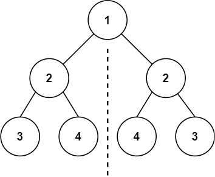

## 题目
[101 对称二叉树](https://leetcode-cn.com/problems/symmetric-tree/submissions/)
给你一个二叉树的根节点 root ， 检查它是否轴对称。

示例 1：

## 思路
**判断对称二叉树要比较的是哪两个节点，要比较的可不是左右节点！**
因为我们要比较的是根节点的两个子树是否是相互翻转的，进而判断这个树是不是对称树，所以要比较的是两个树，参数自然也是左子树节点和右子树节点。

需要判断的情况有：（**注意比较的不是左孩子和右孩子，所以如下我称之为左节点右节点**）

- 左为空，右不为空，不对称，return false
- 左不为空，右为空，不对称 return false
- 左右都为空，对称，返回true
- 左右都不为空，比较节点数值，不相同就return false
```cpp
class Solution
{
public:
    bool isSymmetric(TreeNode *root)
    {
        if (root == nullptr)
            return true;

        return compareSubTree(root->left, root->right);
    }

private:
    bool compareSubTree(TreeNode *left, TreeNode *right)
    {
        if (left == nullptr && right == nullptr)
            return true;
        else if (left != nullptr && right != nullptr)
        {
            if (left->val != right->val)
                return false;

            return compareSubTree(left->left, right->right) && compareSubTree(left->right, right->left);
        }
        else
            return false;
    }
};
```
## leetcode 100
100是判断两个二叉树是否相同，与本题递归的逻辑一样，唯一的不同是递归的时候

- 左子树和左子树比较
- 右子树和右子树比较
