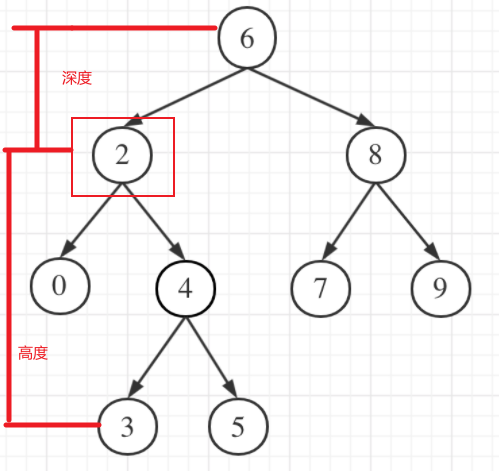

## 题目
[110 平衡二叉树](https://leetcode-cn.com/problems/balanced-binary-tree/submissions/)
给定一个二叉树，判断它是否是高度平衡的二叉树。
本题中，一棵高度平衡二叉树定义为：
一个二叉树每个节点 的左右两个子树的高度差的绝对值不超过 1 
## 思路
咋眼一看这道题目和leetcode104很像，其实有很大区别。

- 二叉树节点的深度：指**从根节点到该节点**的最长简单路径边的条数。
- 二叉树节点的高度：指**从该节点到叶子节点**的最长简单路径边的条数

以下图节点2为例看看高度和深度：

本题输入参数为当前节点，要比较左右子树的高度，就要遍历左子树和右子树获取高度的最大值，然后比较差值是否大于1

- 节点满足差值小于1，则继续递归left和right节点
- 节点不满足差值小于1，直接return false

获取高度需要递归，我们看递归的要求

1. 递归的输入和返回：输入节点，返回高度
1. 递归结束条件：
   1. 当前节点为空，返回0
   1. 当前节点的左右子节点为空，也就是没有左右子树了，返回1（当前节点）
```cpp
class Solution
{
public:
    bool isBalanced(TreeNode *root)
    {
        if (root == nullptr)
            return true;

        if (abs(getTreeDepth(root->left) - getTreeDepth(root->right)) > 1)
            return false; //本节点的左右子树高度差过大,返回
        else
            //本阶段高度差符合要求,继续遍历子节点
            return isBalanced(root->left) && isBalanced(root->right);
    }

private:
    //获取树高度
    int getTreeDepth(TreeNode *l)
    {
        if (l == nullptr)
            return 0;
        else if (l->left == nullptr && l->right == nullptr)
            return 1;
        else
            //遍历获取高度，取最大高度
            return 1 + max(getTreeDepth(l->left), getTreeDepth(l->right));
    }
};
```


