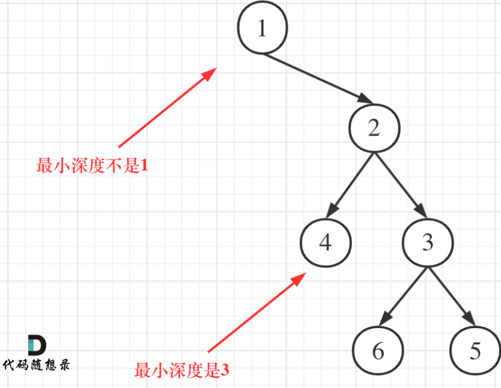

## 题目
[111 二叉树的最小深度](https://leetcode-cn.com/problems/minimum-depth-of-binary-tree/submissions/)
给定一个二叉树，找出其最小深度。
最小深度是从根节点到最近叶子节点的最短路径上的节点数量。
说明：叶子节点是指没有子节点的节点。

示例1
输入：root = [3,9,20,null,null,15,7]
输出：2

示例 2：
输入：root = [2,null,3,null,4,null,5,null,6]
输出：5
## 思路
本题不能用层序遍历了，因为是取最小深度。所以本题需要先确定递归的停止条件：

1. 递归函数形式：就是`intminDepth(TreeNode*root)`
1. 递归停止的条件：
   1. root节点为空，返回0
   1. root节点的**左右子节点都为空**，表示root为叶子节点，返回1（root本身）

一定要注意条件b，root某个子节点为空要继续遍历另一个不空的节点，不能返回。不然就出现下面错误：

```cpp
class Solution
{
public:
    int minDepth(TreeNode *root)
    {
        if (root == nullptr)
            return 0; //情况a
        if (root->left == nullptr && root->right == nullptr)
            return 1; //情况b

        if (root->left == nullptr && root->right != nullptr)
            return 1 + minDepth(root->right);
        if (root->right == nullptr && root->left != nullptr)
            return 1 + minDepth(root->left);

        return 1 + min(minDepth(root->left), minDepth(root->right));
    }
};
```
