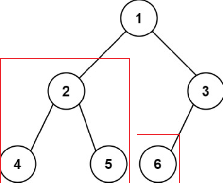

## 题目
[222 完全二叉树的节点个数](https://leetcode-cn.com/problems/count-complete-tree-nodes/submissions/)
给你一棵 完全二叉树 的根节点 root ，求出该树的节点个数。
完全二叉树 的定义如下：在完全二叉树中，除了最底层节点可能没填满外，其余每层节点数都达到最大值，并且最下面一层的节点都集中在该层最左边的若干位置。若最底层为第 h 层，则该层包含 1~ 2h 个节点。
## 思路
### 遍历所有节点
首先肯定想到的是遍历所有节点四种遍历方式都可以），依次`count++`。但这种方法的时间复杂度较高
```cpp
class Solution {
private:
    int getNodesNum(TreeNode* cur) {
        if (cur == NULL) return 0;
        int leftNum = getNodesNum(cur->left);      // 左
        int rightNum = getNodesNum(cur->right);    // 右
        int treeNum = leftNum + rightNum + 1;      // 中
        return treeNum;
    }
public:
    int countNodes(TreeNode* root) {
        return getNodesNum(root);
    }
};
```
### 利用完全二叉树的特性
完全二叉树只有两种情况，**情况一：就是满二叉树（无左右子节点的节点也是满二叉树），情况二：最后一层叶子节点没有满**。

- 对于情况一，可以直接用 `2^depth - 1`来计算，注意这里根节点深度为1。
- 对于情况二，分别递归左孩子，和右孩子，**递归到某一深度一定会有左孩子或者右孩子为满二叉树**，然后依然可以按照情况1来计算


可以看出如果整个树不是满二叉树，就递归其左右孩子，直到遇到满二叉树为止，用公式计算这个子树（满二叉树）的节点数量。
```cpp
class Solution {
public:
    int countNodes(TreeNode* root) {
        if (root == nullptr) return 0;
        TreeNode* left = root->left;
        TreeNode* right = root->right;
        int leftHeight = 0, rightHeight = 0; // 这里初始为0是有目的的，为了下面求指数方便
        while (left) {  // 求左子树深度
            left = left->left;
            leftHeight++;
        }
        while (right) { // 求右子树深度
            right = right->right;
            rightHeight++;
        }
        if (leftHeight == rightHeight) {
            return (2 << leftHeight) - 1;//左右深度为0，则为情况1
        }
        //递归直到遇到情况1
        return countNodes(root->left) + countNodes(root->right) + 1;
    }
};
```
