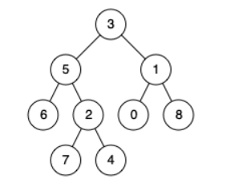

## 题目
[236 二叉树的最近公共祖先](https://leetcode-cn.com/problems/lowest-common-ancestor-of-a-binary-tree/submissions/)
给定一个二叉树, 找到该树中两个指定节点的最近公共祖先。
说明:
所有节点的值都是唯一的。
p、q 为不同节点且均存在于给定的二叉树中。

输入：root = [3,5,1,6,2,0,8,null,null,7,4], p = 5, q = 1
输出：3
解释：节点 5 和节点 1 的最近公共祖先是节点 3 。
## 思路
如何判断一个节点是节点q和节点p的公共公共祖先呢。

- 如果找到一个节点，发现左子树出现结点p，右子树出现节点q，或者左子树出现结点q，右子树出现节点p，那么该节点就是节点p和q的最近公共祖先。

递归三部曲

- 确定递归函数返回值以及参数：`TreeNode* lowestCommonAncestor(TreeNode* root, TreeNode* p, TreeNode* q)`
- 确定终止条件：找到了 节点p或者q，或者遇到空节点，就返回
- 确定单层递归逻辑：
   - 如果left 和 right都不为空，说明此时root就是最近公共节点
   - 如果left为空，right不为空，就返回right，说明目标节点是通过right返回的，反之依然
   - 如果left和right都为空，说明没找到p和q，返回null
```cpp
class Solution
{
public:
    TreeNode *lowestCommonAncestor(TreeNode *root, TreeNode *p, TreeNode *q)
    {
        if (root == nullptr)
            return nullptr;
        if (root == p || root == q)//p和q肯定存在于树里，所以这里用或就可以
            return root;
        //后序遍历左右中，最后的是中间父节点
        TreeNode *left = lowestCommonAncestor(root->left, p, q);
        TreeNode *right = lowestCommonAncestor(root->right, p, q);
        if (left == nullptr && right != nullptr)
            return right;
        else if (left != nullptr && right == nullptr)
            return left;
        else if (left != nullptr && right != nullptr)
            return root;
        else
            return nullptr;
    }
};
```
## leetcode 235
235是二叉搜索树的最小公共祖先，比上面普通的二叉树更方便的是：**我们可以先判断p和q的值在二叉搜索树的哪一边；知道了哪一边，只需要迭代某一边即可，不需要向上面一样后序遍历所以子树。**
```cpp
class Solution
{
public:
    TreeNode *lowestCommonAncestor(TreeNode *root, TreeNode *p, TreeNode *q)
    {
        if (root->val > p->val && root->val > q->val)
        {//p和q值都小于root，肯定在左子树
            return lowestCommonAncestor(root->left, p, q);
        }
        else if (root->val < p->val && root->val < q->val)
        {//p和q值都大于root，肯定在右子树
            return lowestCommonAncestor(root->right, p, q);
        }
        else
            return root;//p和q肯定一边一个,所以root是公共祖先
    }
};
```
