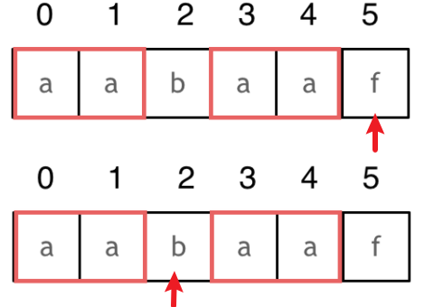
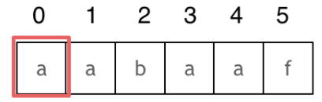
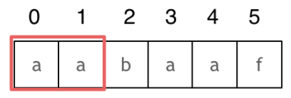
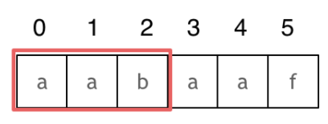
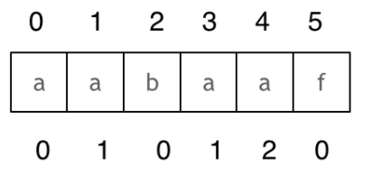
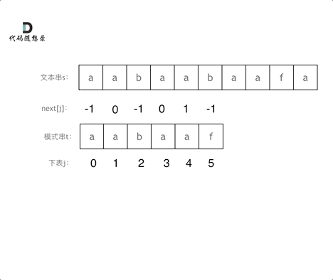

> 在一个串中查找是否出现过另一个串，这是KMP的看家本领

## 什么是KMP
因为是由这三位学者发明的：Knuth，Morris和Pratt，所以取了三位学者名字的首字母。所以叫做KMP。KMP主要应用在字符串匹配上。

KMP的主要思想是**当出现字符串不匹配时，可以记录一部分之前已经匹配的文本内容，利用这些信息避免从头再去做匹配。**
如何记录已经匹配的文本内容，是KMP的重点，也是**next数组**肩负的重任。
## 前缀表
**前缀表是用来回退的，它记录了模式串与主串(文本串)不匹配的时候，模式串应该从哪里开始重新匹配。**

举例：
要在文本串：aabaabaafa 中查找是否出现过一个模式串：aabaaf。
如动画所示：


可以看出，文本串中第六个字符b和模式串的第六个字符f，不匹配了。

- 如果是暴力匹配，发现不匹配，此时就要从头匹配模式串了。
- 如果使用前缀表，则不必从头匹配，而是**从上次已经匹配的内容开始匹配**，找到了模式串中第三个字符b继续匹配

前缀表**记录下标i之前（包括i）的字符串中，有多大长度的相同前后缀。**在某个字符失配时，前缀表会告诉你下一步匹配中，模式串应该跳到哪个位置。
### 最长公共前后缀

- **前缀：不包含最后一个字符的所有以第一个字符开头的连续子串**。
- **后缀：不包含第一个字符的所有以最后一个字符结尾的连续子串**。


前缀表要求的就是**相同前后缀的长度（即最长公共前后缀）**。例如

- 字符串a的最长相等前后缀为0
- 字符串aa的最长相等前后缀为1
- 字符串aaa的最长相等前后缀为2

回顾刚刚的例子，刚刚匹配的过程在下标5的地方遇到不匹配，然后就找到了下标2，指向b，继续匹配：如图：

下标5之前这部分的字符串（也就是字符串aabaa）的**最长相等的前缀和后缀字符串是子字符串aa**，因为找到了最长相等的前缀和后缀，**匹配失败的位置是后缀子串的后面，那么我们找到与其相同的前缀的后面从新匹配**。

### 如何计算前缀表

- 长度为前1个字符的子串`a`，最长相同前后缀的长度为0



-  长度为前2个字符的子串`aa`，最长相同前后缀的长度为1



- 长度为前3个字符的子串`aab`，最长相同前后缀的长度为0


以此类推：

- 长度为前4个字符的子串`aaba`，最长相同前后缀的长度为1
- 长度为前5个字符的子串`aabaa`，最长相同前后缀的长度为2
- 长度为前6个字符的子串`aabaaf`，最长相同前后缀的长度为0

那么把求得的最长相同前后缀的长度对应到相应的index（**下标i之前的字符串中，有多大长度的相同前后缀）**为：

### 如何使用前缀表
再来看一下如何利用前缀表找到当字符不匹配的时候应该指针应该移动的位置，如动画所示：


- 当到达不匹配的位置，要看它的前一个字符的前缀表的数值是多少
- 前一个字符的前缀表的数值是2， 所以把下标移动到 index 2的位置继续比对
## 前缀表与next数组
next数组用于实现前缀表的回退操作，分为两种：

- next数组就是**前缀表**
- next数组是**前缀表统一减一（右移一位，初始位置为-1）**


**下面用前缀表统一减一的next数组来演示KMP算法**
### 构造next数组
我们定义一个函数getNext来构建next数组，函数参数为指向next数组的指针，和一个字符串。 代码如下：
```
void getNext(int* next, const string& s)
```
**构造next数组其实就是计算模式串s的前缀表的过程。** 主要有如下三步：

1. 初始化
1. 处理前后缀不相同的情况
1. 处理前后缀相同的情况

代码构造next数组的逻辑流程动画如下：


```cpp
//获取前缀表统一减一形式的next数组
void getNext(int *next, const string &s)
{
    int j = -1; // j指向前缀起始位置
    next[0] = j;
    // i指向后缀起始位置,i从1开始
    for (int i = 1; i < s.size(); i++)
    {
        while (j >= 0 && s[i] != s[j + 1])
        {
            //前后缀不相同的情况
            j = next[j]; // 向前回退,找j+1前一个元素在next数组里的值
        }
        if (s[i] == s[j + 1])
        {
            //前后缀相同的情况
            j++; // i和j向后移动,i++在for里面
        }
        next[i] = j; // 将j（前缀的长度）赋给next[i]
    }
}
```

### 使用next数组做匹配
使用前缀表**统一减一之后的next数组**进行匹配的过程如下：

```cpp
//在文本串s里找是否出现过模式串t
int j = -1; // 因为next数组里记录的起始位置为-1
// i从0开始遍历文本串s
for (int i = 0; i < s.size(); i++)
{
    while (j >= 0 && s[i] != t[j + 1])
    {
        // 不匹配
        j = next[j]; // j 寻找之前匹配的位置
    }
    if (s[i] == t[j + 1])
    {
        // 匹配，j和i同时向后移动
        j++; // i++在for循环里
    }
    if (j == (t.size() - 1))
    {
        // j指向了模式串t的末尾，那么就说明模式串t完全匹配文本串s里的某个子串
        return (i - t.size() + 1);//返回匹配子串的头index
    }
}
```

