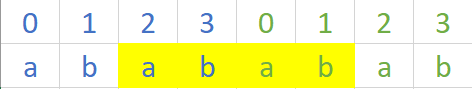

## 题目
[459 重复的子字符串](https://leetcode-cn.com/problems/repeated-substring-pattern/)
给定一个非空的字符串，判断它是否可以由它的一个子串重复多次构成。给定的字符串只含有小写英文字母，并且长度不超过10000。

示例 1:
输入: "abab"
输出: True
解释: 可由子字符串 "ab" 重复两次构成
## 思路
### KMP算法
KMP是解决子串匹配问题的法宝，本题是在字符串内部寻找子串，也是子串匹配问题，也适用KMP。
对于重复子串问题，KMP前缀表有如下规则：

- **如果**`**next[len - 1] != 0**`**，则说明字符串有最长相同的前后缀**
- **如果**`**len % (len - next[len - 1]) == 0**`**，则说明 (数组长度-最长相等前后缀的长度) 正好可以被 数组的长度整除，说明有该字符串有重复的子字符串**

所以该问题只要得到前缀表再判断一下就可以了
```cpp
class Solution
{
public:
    bool repeatedSubstringPattern(string s)
    {
        if (s.size() == 0)
        {
            return false;
        }
        int next[s.size()];
        getNext(next, s);
        
        int len = s.size();
        if (next[len - 1] != 0 && len % (len - (next[len - 1])) == 0)
        {
            return true;
        }
        return false;
    }

private:
    //获取原始前缀表
    void getNext(int *next, const string &s)
    {
        int j = 0; // j指向前缀起始位置
        next[0] = 0;
        // i指向后缀起始位置,i从1开始
        for (int i = 1; i < s.size(); i++)
        {
            while (j > 0 && s[i] != s[j])
            {
                //前后缀不相同的情况
                j = next[j - 1]; // 向前回退,找j+1前一个元素在next数组里的值
            }
            if (s[i] == s[j])
            {
                //前后缀相同的情况
                j++; // i和j向后移动,i++在for里面
            }
            next[i] = j;
        }
    }
};
```
### 找规律的简便方法
KMP展现的是数学证明上的结论，本题也能从表象上展示出来：

如图，我们把两个字符串s拼接起来，如果能找到一个和s一样的子串（该子串与字符串s一样，且起始index不为0），则字符串s就是由某个字串多次重复形成的。
```cpp
class Solution {
public:
    bool repeatedSubstringPattern(string s) {
        return (s + s).find(s, 1) != s.size();
    }
};
```
