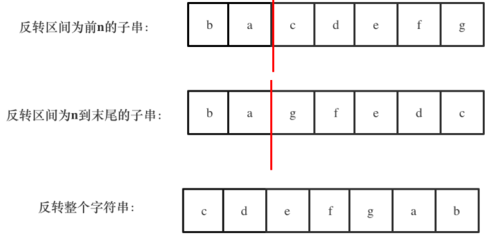

## 题目
[剑指offer 58 左旋转字符串](https://leetcode-cn.com/problems/zuo-xuan-zhuan-zi-fu-chuan-lcof/submissions/)
字符串的左旋转操作是把字符串前面的若干个字符转移到字符串的尾部。请定义一个函数实现字符串左旋转操作的功能。比如，输入字符串"abcdefg"和数字2，该函数将返回左旋转两位得到的结果"cdefgab"。

示例 1：
输入: s = "abcdefg", k = 2
输出: "cdefgab"
## 思路
在leetcode 344和leetcode 151我们看到字符之间反转，并且在leetcode151中通过整个字符串反转和单词反转得到了复杂变化后的样子。
本题我们也可以用**字符串反转（当然，反转内部还是双指针实现的）**来解决：局部反转+整体反转。具体步骤为：

1. 反转区间为前n的子串
1. 反转区间为n到末尾的子串
1. 反转整个字符串


```cpp
class Solution
{
public:
    string reverseLeftWords(string s, int n)
    {
        reverseRangeString(s, 0, n - 1);
        reverseRangeString(s, n, s.size() - 1);
        reverseRangeString(s, 0, s.size() - 1);
        return s;
    }

private:
    void reverseRangeString(string &s, int l, int r)
    {
        char tmp;
        for (int left = l, right = r; left < right; left++, right--)
        {
            tmp = s[left];
            s[left] = s[right];
            s[right] = tmp;
        }
    }
};
```
