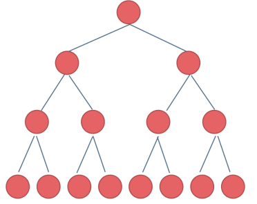
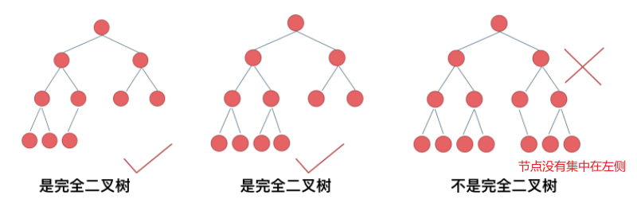
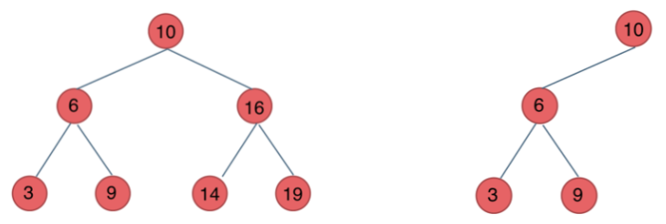
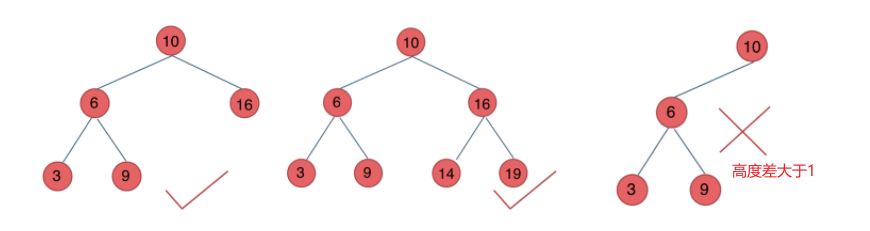
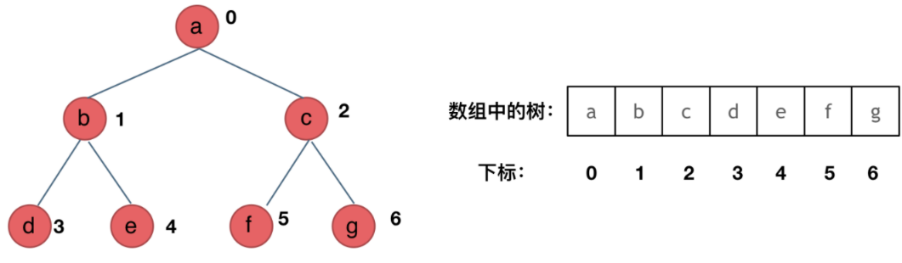
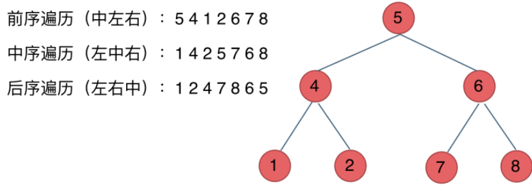
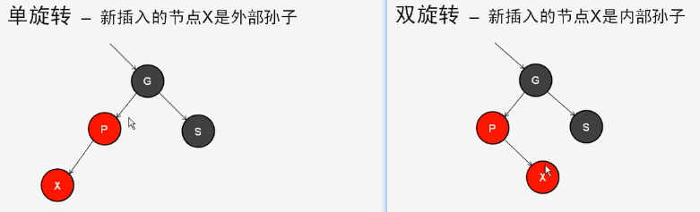
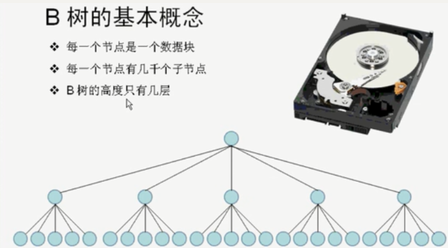

## 二叉树分类
### 满二叉树
深度为k，有2^k-1个节点的二叉树，即所有节点都存在<br />
### 完全二叉树
除了最底层节点可能没填满外，其余每层节点数都达到最大值，并且最下面一层的节点都集中在该层最左边的若干位置（优先级队列其实是一个堆，堆就是一棵完全二叉树，同时保证父子节点的顺序关系）<br />
### 二叉搜索树
**二叉搜索树是一个有序树**。

- 每一个节点有一个值，不允许重复
- 若它的左子树不空，则左子树上所有结点的值均小于它的根结点的值；
- 若它的右子树不空，则右子树上所有结点的值均大于它的根结点的值；
- 它的左、右子树也分别为二叉排序树

<br />代码模板如下：
```cpp
#ifndef BST_H
#define BST_H
#include <iostream>

template <typename T>
class BST; //前置声明

template <typename T>
class Element
{
public:
    T key; //将键值单独一个类放置，方便扩展数据结构
};

template <typename T>
class BstNode
{
    friend class BST<T>; //友元类，可以访问私有成员
public:
    Element<T> data;

private:
    BstNode *leftChild;
    BstNode *rightChild;
};

template <typename T>
class BST
{
public:
    BST(BstNode<T> *init = 0)
    {
        root = init;
    }
    bool insertKey(const Element<T> &ele); //插入数据
    BstNode<T> *search(const Element<T> &ele);
    BstNode<T> *search(BstNode<T> *start, const Element<T> &ele); //递归查找数据
    BstNode<T> *forSearch(const Element<T> &ele);                 //迭代查找数据
    void display()
    {
        if (root)
            display(root);
        else
            std::cout << "no nodes" << std::endl;
    }
    void display(BstNode<T> *node); //显示节点数据
private:
    BstNode<T> *root;
};

template <typename T>
void BST<T>::display(BstNode<T> *node)
{
    if (!node)
    {
        return;
    }
    //显示当前节点及其左右子树的key
    std::cout << "data.key: " << node->data.key << std::endl;
    if (node->leftChild)
    {
        display(node->leftChild);
    }
    if (node->rightChild)
    {
        display(node->rightChild);
    }
}

template <typename T>
bool BST<T>::insertKey(const Element<T> &ele)
{
    BstNode<T> *p = root;
    BstNode<T> *q = nullptr; // q为p的父节点
    //插入之前需要先查找，找到合适的位置
    while (p)
    {
        q = p; // p改变之前，q指向当前节点
        if (ele.key == p->data.key)
        {
            return false; //值重复，失败返回
        }
        else if (ele.key < p->data.key)
        {
            //小于，继续查找当前节点左子树
            p = p->leftChild;
        }
        else
        {
            //大于，继续查找当前节点右子树
            p = p->rightChild;
        }
    }
    //循环结束，合适的位置就是q
    p = new BstNode<T>; //创建新节点
    p->leftChild = nullptr;
    p->rightChild = nullptr;
    p->data = ele;
    if (!root)
        root = p; //没有根节点，p就是根节点
    else if (ele.key < q->data.key)
    {
        q->leftChild = p;
    }
    else
    {
        q->rightChild = p;
    }

    return true;
}

template <typename T>
BstNode<T> *BST<T>::search(const Element<T> &ele)
{
    if (root)
        return search(root, ele);
    else
        return nullptr;
}

template <typename T>
BstNode<T> *BST<T>::search(BstNode<T> *start, const Element<T> &ele)
{
    if (!start)
        return nullptr;

    if (start->data.key == ele.key)
    {
        return start;
    }
    else if (start->data.key > ele.key)
    {
        return search(start->leftChild, ele);
    }
    else
    {
        return search(start->rightChild, ele);
    }
}

template <typename T>
BstNode<T> *BST<T>::forSearch(const Element<T> &ele)
{
    for (BstNode<T> *n = root; n != nullptr;)
    {
        if (ele.key == n->data.key)
        {
            return n;
        }
        else if (ele.key < n->data.key)
        {
            n = n->leftChild;
        }
        else
        {
            n = n->rightChild;
        }
    }
    return nullptr;
}
#endif // BST_H
```
### 平衡二叉搜索树
被称为AVL（Adelson-Velsky and Landis）树，且具有以下性质：它是一棵空树或它的左右两个子树的高度差的绝对值不超过1，并且左右两个子树也是一棵平衡二叉树。<br />C++中**map、set、multimap，multiset的底层实现都是平衡二叉搜索树**，所以map、set的增删操作时间时间复杂度是logn<br />
## 二叉树存储方式
**二叉树可以链式存储，也可以顺序存储。**链式存储方式就用指针， 顺序存储的方式就是用数组。<br /><br />用数组来存储二叉树如何遍历的呢？**如果父节点的数组下标是 i，那么它的左孩子就是 i * 2 + 1，右孩子就是 i * 2 + 2。**

## 二叉树如何遍历
### 遍历方式分类

- 深度优先遍历
   - 前序遍历（递归法，迭代法）：中左右
   - 中序遍历（递归法，迭代法）：左中右
   - 后序遍历（递归法，迭代法）：左右中
- 广度优先遍历
   - 层次遍历（迭代法）


### 递归遍历模板
可以根据下面的模板试试leetcode94，144，145
```.cpp
#ifndef BINARY_TREE_HPP
#define BINARY_TREE_HPP
#include <iostream>
#include <queue>

template <typename T>
class TreeNode
{
public:
    TreeNode(T val) : data(val), leftChild(nullptr), rightChild(nullptr) {}
    T data;
    TreeNode<T> *leftChild;
    TreeNode<T> *rightChild;
};

template <typename T>
class BinaryTree
{
public:
    //二叉树的遍历操作
    void InOrder(TreeNode<T> *currentNode);    //中序遍历：左子树-节点-右子树
    void PreOrder(TreeNode<T> *currentNode);   //前序遍历 节点-左子树-右子树
    void PostOrder(TreeNode<T> *currentNode);  //后续遍历 左子树-右子树-节点
    void LevelOrder(TreeNode<T> *currentNode); //层序遍历, 一层一层显示value

    void showNodeValue(TreeNode<T> *currentNode);

    TreeNode<T> *root;
};

template <typename T>
void BinaryTree<T>::InOrder(TreeNode<T> *currentNode)
{
    if (currentNode)
    {
        //左子树递归
        InOrder(currentNode->leftChild);
        //显示当前节点
        showNodeValue(currentNode);
        //右子树递归
        InOrder(currentNode->rightChild);
    }
}

template <typename T>
void BinaryTree<T>::PreOrder(TreeNode<T> *currentNode)
{
    if (currentNode)
    {
        //显示当前节点
        showNodeValue(currentNode);
        //左子树递归
        PreOrder(currentNode->leftChild);
        //右子树递归
        PreOrder(currentNode->rightChild);
    }
}

template <typename T>
void BinaryTree<T>::PostOrder(TreeNode<T> *currentNode)
{
    if (currentNode)
    {
        //左子树递归
        PostOrder(currentNode->leftChild);
        //右子树递归
        PostOrder(currentNode->rightChild);
        //显示当前节点
        showNodeValue(currentNode);
    }
}

template <typename T>
void BinaryTree<T>::LevelOrder(TreeNode<T> *currentNode)
{
    //层序遍历无法使用递归法实现
}

template <typename T>
void BinaryTree<T>::showNodeValue(TreeNode<T> *currentNode)
{
    std::cout << currentNode->data;
}
#endif
```
### 迭代遍历模板
```cpp
#ifndef BINARY_TREE_HPP
#define BINARY_TREE_HPP
#include <iostream>
#include <queue>
#include <vector>
#include <stack>

template <typename T>
class TreeNode
{
public:
    TreeNode(T val) : data(val), leftChild(nullptr), rightChild(nullptr) {}
    T data;
    TreeNode<T> *leftChild;
    TreeNode<T> *rightChild;
};

template <typename T>
class BinaryTree
{
public:
    //二叉树的遍历操作
    void InOrder(TreeNode<T> *currentNode);    //中序遍历：左子树-节点-右子树
    void PreOrder(TreeNode<T> *currentNode);   //前序遍历 节点-左子树-右子树
    void PostOrder(TreeNode<T> *currentNode);  //后续遍历 左子树-右子树-节点
    void LevelOrder(TreeNode<T> *currentNode); //层序遍历, 一层一层显示value

    void showNodeValue(TreeNode<T> *currentNode);

    TreeNode<T> *root;
};

template <typename T>
void BinaryTree<T>::InOrder(TreeNode<T> *currentNode)
{
    std::stack<TreeNode<T> *> st;
    if (root != NULL)
        st.push(root);
    while (!st.empty())
    {
        TreeNode<T> *node = st.top();
        if (node != NULL)
        {
            st.pop(); // 将该节点弹出，避免重复操作，下面再将右中左节点添加到栈中
            if (node->right)
                st.push(node->right); // 添加右节点（空节点不入栈）

            st.push(node); // 添加中节点
            st.push(NULL); // 中节点访问过，但是还没有处理，加入空节点做为标记。

            if (node->left)
                st.push(node->left); // 添加左节点（空节点不入栈）
        }
        else
        {                    // 只有遇到空节点的时候，才将下一个节点放进结果集
            st.pop();        // 将空节点弹出
            node = st.top(); // 重新取出栈中元素
            st.pop();
            //显示当前节点
            showNodeValue(node);
        }
    }
}

template <typename T>
void BinaryTree<T>::PreOrder(TreeNode<T> *currentNode)
{
    std::stack<TreeNode<T> *> st;
    if (root != NULL)
        st.push(root);
    while (!st.empty())
    {
        TreeNode<T> *node = st.top();
        if (node != NULL)
        {
            st.pop();
            if (node->right)
                st.push(node->right); // 右
            if (node->left)
                st.push(node->left); // 左
            st.push(node);           // 中
            st.push(NULL);
        }
        else
        {
            st.pop();
            node = st.top();
            st.pop();
            //显示当前节点
            showNodeValue(node);
        }
    }
}

template <typename T>
void BinaryTree<T>::PostOrder(TreeNode<T> *currentNode)
{
    std::stack<TreeNode<T> *> st;
    if (root != NULL)
        st.push(root);
    while (!st.empty())
    {
        TreeNode<T> *node = st.top();
        if (node != NULL)
        {
            st.pop();
            st.push(node); // 中
            st.push(NULL);

            if (node->right)
                st.push(node->right); // 右
            if (node->left)
                st.push(node->left); // 左
        }
        else
        {
            st.pop();
            node = st.top();
            st.pop();
            //显示当前节点
            showNodeValue(node);
        }
    }
}

template <typename T>
void BinaryTree<T>::LevelOrder(TreeNode<T> *currentNode)
{
    std::queue<TreeNode<T> *> que;
    if (root != NULL)
        que.push(root);

    while (!que.empty())
    {
        int size = que.size();
        // 这里一定要使用固定大小size，不要使用que.size()，因为que.size是不断变化的
        for (int i = 0; i < size; i++)
        {
            TreeNode<T> *node = que.front();
            que.pop();
            showNodeValue(node);

            if (node->left)
                que.push(node->left);
            if (node->right)
                que.push(node->right);
        }
    }
}

template <typename T>
void BinaryTree<T>::showNodeValue(TreeNode<T> *currentNode)
{
    std::cout << currentNode->data;
}
#endif
```
## 红黑树--自平衡二叉查找树
### 红黑规则
**红黑树**（Red–black tree）是一种自平衡二叉查找树。红黑树特征：节点有颜色，插入和删除节点是要遵守红黑规则：

- 每一个节点不是红色就是黑色
- 根节点是黑色
- 如果节点是红色，则它的子节点必须是黑的。即红色不能相邻
- 从根到叶子节点的每条路经，必须包含相同数目的黑色节点

如果当前二叉树不符合红黑规则，有两种自我修正方式：

- 改变节点的颜色
- 旋转
### 旋转
旋转分为单旋转和双旋转，应用于下面场景：<br />
### 代码模板
红黑树代码讲解：[https://www.bilibili.com/video/av31763085/?p=28](https://www.bilibili.com/video/av31763085/?p=28)
```cpp
#ifndef REDBLACKTREE_H
#define REDBLACKTREE_H
#include "except.h"

template <class T>
class RedBlackTree;

template <typename T>
class RedBlackNode;

//红黑树
template <typename T>
class RedBlackTree
{
public:
    enum
    {
        RED,
        BLACK
    };
    typedef RedBlackNode<T> Node;

    RedBlackTree(const T &negInf);
    ~RedBlackTree();

    void insert(const T &x);
    void rotateWithLeftChild(Node *&K2) const;            //单旋转，向右
    void rotateWithRightChild(Node *&k1) const;           //单旋转，向左
    void doubleRotateWithLeftChild(Node *&K2) const;      //双旋转
    void doubleRotateWithRightChild(Node *&k1) const;     //双旋转
    void handleReorient(const T &item);                   //平滑处理
    RedBlackNode<T> *rotate(const T &item, Node *parent); //旋转函数

    bool isEmpty();
    void makeEmpty();
    void deleteNodes(Node *start); //删除从start开始往后所有节点

    bool find(const T &x, Node *node);
    bool findMin(T &value);
    bool findMax(T &value);

    // private:  //just for test
    Node *header;   //指向root根节点的指针
    Node *nullNode; //无子节点

    Node *current;
    Node *parent; //父节点
    Node *grand;  //祖父节点
    Node *great;  //曾祖父节点
};

//红黑树节点
template <typename T>
class RedBlackNode
{
public:
    friend class RedBlackTree<T>;
    RedBlackNode(const T &theElement = T(),
                 RedBlackNode *lt = nullptr,
                 RedBlackNode *rt = nullptr,
                 int c = RedBlackTree<T>::BLACK)
    {
        element = theElement;
        left = lt;
        right = rt;
        color = c;
    }
    // private:
    T element;
    RedBlackNode *left;
    RedBlackNode *right;
    int color; //颜色
};

template <typename T>
RedBlackTree<T>::RedBlackTree(const T &neginf)
{
    nullNode = new Node();
    nullNode->left = nullNode->right = nullNode;

    //构造函数指定header为负无穷大
    header = new Node(neginf);
    header->left = header->right = nullNode;
}

template <typename T>
RedBlackTree<T>::~RedBlackTree()
{
    makeEmpty();
    delete nullNode;
    delete header;
}

template <typename T>
void RedBlackTree<T>::insert(const T &x)
{
    current = parent = grand = header;
    nullNode->element = x;
    //查找位置
    while (current->element != x)
    {
        great = grand;
        grand = parent;
        parent = current;

        current = x < current->element ? current->left : current->right;

        //检查：如果当前节点，左右儿子节点都是红色，需要处理
        if (current->left->color == RED && current->right->color == RED)
        {
            handleReorient(x);
        }
    }

    if (current != nullNode)
        throw DuplicateItemException();

    current = new Node(x, nullNode, nullNode);
    if (x < parent->element)
        parent->left = current;
    else
        parent->right = current;

    //自动平滑当前树，变为红黑树(重点)
    handleReorient(x);
}

//向右旋转
template <typename T>
void RedBlackTree<T>::rotateWithLeftChild(Node *&k2) const
{
    Node *k1 = k2->left;
    k2->left = k1->right;
    k1->right = k2;
    k2 = k1;
}

//向左旋转
template <typename T>
void RedBlackTree<T>::rotateWithRightChild(Node *&k1) const
{
    Node *k2 = k1->right;
    k1->right = k2->left;
    k2->left = k1;
    k1 = k2;
}

template <typename T>
void RedBlackTree<T>::doubleRotateWithLeftChild(Node *&k2) const
{
    rotateWithRightChild(k2->left);
    rotateWithLeftChild(k2);
}

template <typename T>
void RedBlackTree<T>::doubleRotateWithRightChild(Node *&k1) const
{
    rotateWithLeftChild(k1->right);
    rotateWithRightChild(k1);
}

template <typename T>
void RedBlackTree<T>::handleReorient(const T &item)
{
    //变色
    current->color = RED;
    current->left->color = BLACK;
    current->right->color = BLACK;

    if (parent->color == RED)
    {
        grand->color = RED;
        if ((item < grand->element) != (item < parent->element))
        {
            parent = rotate(item, grand); //单旋转
        }
        current = rotate(item, great); //双旋转
        current->color = BLACK;
    }
    header->right->color = BLACK;
}

/*
 * 左子树向右转--LL
 * 左子树向左转--LR
 * 右子树向右转--RL
 * 右子树向左转--RR
 */
template <typename T>
RedBlackNode<T> *RedBlackTree<T>::rotate(const T &item, Node *parent)
{
    if (item < parent->element)
    {
        item < parent->left->element ? rotateWithLeftChild(parent->left)
                                     : rotateWithRightChild(parent->left);
        return parent->left;
    }
    else
    {
        item < parent->right->element ? rotateWithLeftChild(parent->right)
                                      : rotateWithRightChild(parent->right);
        return parent->right;
    }
}

template <typename T>
bool RedBlackTree<T>::isEmpty()
{
    return header->right == nullNode;
}

template <typename T>
void RedBlackTree<T>::makeEmpty()
{
    deleteNodes(header->right);
    header->right = nullNode;
}

template <typename T>
void RedBlackTree<T>::deleteNodes(Node *start)
{
    //使用递归
    if (start != start->left)
    {
        deleteNodes(start->left);
        deleteNodes(start->right);
        delete start;
    }
}

template <typename T>
bool RedBlackTree<T>::find(const T &x, Node *node)
{
    if (isEmpty())
        return false;

    nullNode->element = x;
    Node *start = header->right;
    for (;;)
    {
        if (x < start->element)
        {
            start = start->left;
        }
        else if (x > start->element)
        {
            start = start->right;
        }
        else if (start != nullNode)
        {
            node->element = start->element;
            return true;
        }
        else
            return false;
    }
}

template <typename T>
bool RedBlackTree<T>::findMin(T &value)
{
    if (isEmpty())
        return false;

    //一直向左查找最小
    Node *node = header->right;
    while (node->left != nullNode)
    {
        node = node->left;
    }

    value = node->element;
    return true;
}

template <typename T>
bool RedBlackTree<T>::findMax(T &value)
{
    if (isEmpty())
        return false;

    //一直向左查找最小
    Node *node = header->right;
    while (node->right != nullNode)
    {
        node = node->right;
    }

    value = node->element;
    return true;
}
#endif // REDBLACKTREE_H
```
## B树
B树和红黑树类似，但可以有多个子节点，对减少磁盘IO操作次数有显著作用。B树主要用途如下：

- 实现文件系统：btrfs
- 实现数据库系统的数据文件和索引文件



