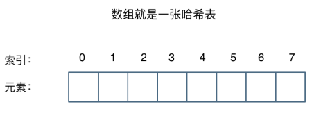
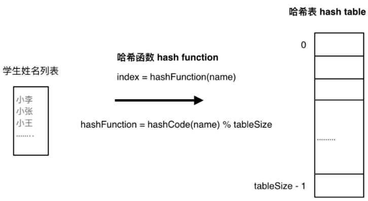
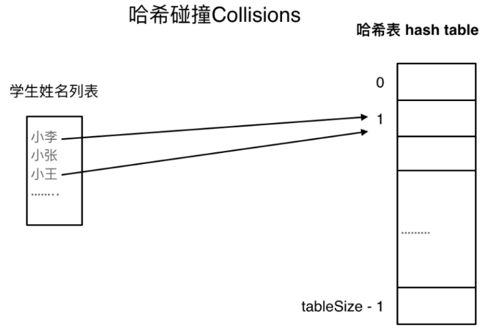
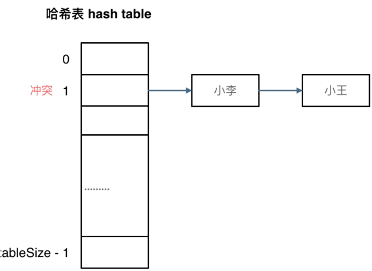
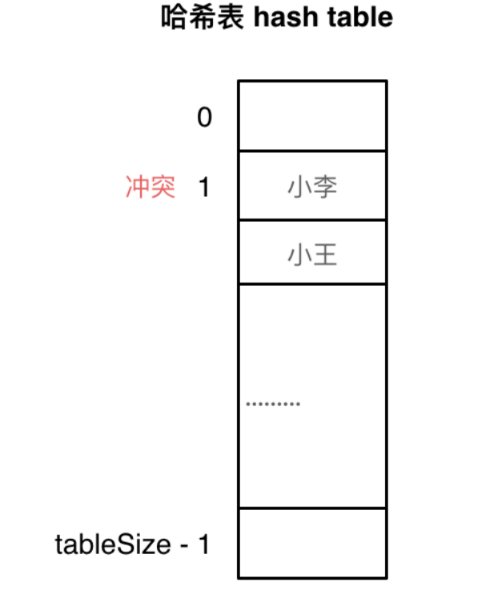

## 定义

哈希映射本质是数组，通过特殊的**哈希函数**将key转换成数组的index，进行存储和读取。如果不用复杂的哈希函数，只是一一映射的话，那就是数组：<br /><br />**一般哈希表都是用来快速判断一个元素是否出现集合里。**例如要查询一个名字是否在这所学校里，要枚举的话时间复杂度是O(n)，但如果使用哈希表的话， 只需要O(1)就可以做到。<br />我们只需要初始化把这所学校里学生的名字都存在哈希表里，在查询的时候通过姓名索引直接就可以知道这位同学在不在这所学校里了。
## hash函数
哈希函数如下图所示，通过hashCode把名字转化为数值，一般hashcode是通过特定编码方式，可以将其他数据格式转化为不同的数值，这样就把学生名字映射为哈希表上的索引数字了（这样看，就是一个一维数组）：<br />
## hash碰撞
如果学生的数量大于哈希表的大小，此时就算哈希函数计算的再均匀，也避免不了会有几位学生的名字同时映射到哈希表同一个索引下标的位置，这种现象就叫**hash碰撞**。<br />
### 拉链法
拉链法是在hash碰撞发生后，将索引冲突的元素放在一个链表中。<br />**拉链法要选择适当的哈希表的大小，这样既不会因为数组空值而浪费大量内存，也不会因为链表太长而在查找上浪费太多时间**。<br />
### 线性探测法
使用线性探测法，一定要保证tableSize大于dataSize，因为需要**依靠哈希表中的空位来解决碰撞问题**。<br />例如冲突的位置，放了小李，那么就向下找一个空位放置小王的信息。<br />
## C++中的hash结构
C++中有如下三种已有的hash结构（数组没啥说的）
### set
| **集合** | **底层实现** | **是否有序** | **数值是否可以重复** | **能否更改数值** | **查询效率** | **增删效率** |
| --- | --- | --- | --- | --- | --- | --- |
| std::set | 红黑树 | 有序 | 否 | 否 | O(logn) | O(logn) |
| std::multiset | 红黑树 | 有序 | 是 | 否 | O(logn) | O(logn) |
| std::unordered_set | **哈希表** | 无序 | 否 | 否 | O(1) | O(1) |

### map
| **映射** | **底层实现** | **是否有序** | **数值是否可以重复** | **能否更改数值** | **查询效率** | **增删效率** |
| --- | --- | --- | --- | --- | --- | --- |
| std::map | 红黑树 | key有序 | key不可重复 | key不可修改 | O(logn) | O(logn) |
| std::multimap | 红黑树 | key有序 | key可重复 | key不可修改 | O(logn) | O(logn) |
| std::unordered_map | **哈希表** | key无序 | key不可重复 | key不可修改 | O(1) | O(1) |

## code

```cpp
#ifndef HASHMAP_H
#define HASHMAP_H
#include <vector>
#include <cstdlib>

template<typename Key, typename Value>
class HashMap
{
public:
    HashMap(int size = 101) : arr(size)
    {
        currentSize = 0;
    }
    void Put(const Key& k, const Value& v)
    {
        int index = hash(k);
        arr[index] = DataEntry(k,v);
        currentSize++;
    }
    Value Get(const Key& k)
    {
        int index = hash(k);
        if (arr[index].key == k)
            return arr[index].value;

        else
            return Value();
    }
    //关键，哈希函数
    unsigned hash(const Key& k) const
    {
        unsigned int hashValue = 0;
        for (auto i : k) {
            hashValue = 37 * hashValue + i;
        }
        hashValue %= arr.size();
        return hashValue;
    }
private:
    struct DataEntry
    {
        Key key;
        Value value;
        DataEntry(const Key& k=Key(), const Value& v=Value()):key(k),value(v){}
    };
    std::vector<DataEntry> arr;
    int currentSize;
};

#endif // HASHMAP_H
```
