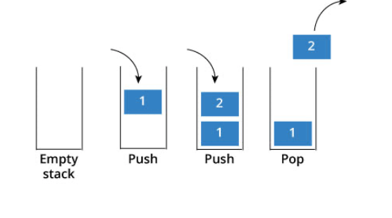
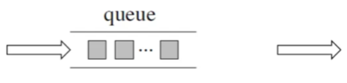

## 栈
栈提供push 和 pop 等等接口，所有元素必须符合先进后出规则，所以栈不提供index随机访问功能，也不提供迭代器(iterator)，不像是set 或者map 提供迭代器iterator来遍历所有元素。<br />

**栈是以底层容器完成其所有的工作，对外提供统一的接口，底层容器是可插拔的**（栈的内部结构，栈的底层实现可以是vector，deque，list 都是可以的， 主要就是数组和链表的底层实现）**。**所以STL中栈往往不被归类为容器，而被归类为container adapter（容器适配器）。

**常用的GCC STL，如果没有指定底层实现的话，默认是以deque为缺省情况下栈的低层结构。**deque是一个双向队列，只要封住一段，只开通另一端就可以实现栈的逻辑了。<br />我们也可以手动指定vector为栈的底层实现，初始化语句如下：
```cpp
std::stack<int, std::vector<int> > third;  // 使用vector为底层容器的栈
```
### leetcode225
[225 用队列实现栈](https://leetcode-cn.com/problems/implement-stack-using-queues/)<br />**仅使用两个队列**实现一个后入先出（LIFO）的栈：

- push(x) -- 元素 x 入栈
- pop() -- 移除栈顶元素
- top() -- 获取栈顶元素
- empty() -- 返回栈是否为空

**队列是先进先出的规则，把一个队列中的数据导入另一个队列中，数据的顺序并没有变，并没有变成先进后出的顺序。**所以用栈实现队列， 和用队列实现栈的思路还是不一样的。<br />依然还是要用两个队列来模拟栈，只不过没有输入和输出的关系，而是另一个队列完全用又来备份的！如下面所示，**用两个队列que1和que2实现队列的功能，que2其实完全就是一个备份的作用**，把que1最后面的元素以外的元素都备份到que2，然后弹出最后面的元素，再把其他元素从que2导回que1：<br />
```cpp
class MyStack
{
public:
    MyStack(){}

    void push(int x)
    {
        que1.push(x);
    }

    int pop()
    {
        for (int size = que1.size(); size > 1; size--)
        { // 将que1 导入que2，但要留下最后一个元素
            que2.push(que1.front());
            que1.pop();
        }

        int result = que1.front(); // 留下的最后一个元素就是要返回的值
        que1.pop();

        que1 = que2; // 再将que2赋值给que1
        while (!que2.empty())
        { // 清空que2
            que2.pop();
        }
        return result;
    }

    int top()
    {
        return que1.back();
    }

    bool empty()
    {
        return que1.empty();
    }

private:
    queue<int> que1;
    queue<int> que2; // 辅助队列，用来备份
};
```
## 队列
<br />队列中先进先出的数据结构，同样不允许index随机访问，不提供迭代器，**GCC STL中队列一样是以deque为缺省情况下的底部结构。**<br />也可以手动指定底层实现，初始化queue的语句如下：
```cpp
std::queue<int, std::list<int>> third; // 定义以list为底层容器的队列 
```
STL 队列也不被归类为容器，也被归类为container adapter（ 容器适配器）
### leetcode232
[232 用栈实现队列](https://leetcode-cn.com/problems/implement-queue-using-stacks/)<br />仅用**两个栈**实现队列的下列操作：

- push(x) -- 将一个元素放入队列的尾部。
- pop() -- 从队列首部移除元素。
- peek() -- 返回队列首部的元素。
- empty() -- 返回队列是否为空。

使用栈来模式队列的行为，如果仅仅用一个栈，是一定不行的，所以需要两个栈**一个输入栈，一个输出栈**<br />
```cpp
class MyQueue
{
public:
    MyQueue()
    {
		//栈自己会初始化,不用写
    }

    void push(int x)
    {
        input.push(x);
    }

    int pop()
    {
        importInputdata();
        int ret = output.top();
        output.pop();
        return ret;
    }

    int peek()
    {
        importInputdata();
        return output.top();
    }

    bool empty()
    {
        return (input.empty() && output.empty());
    }

private:
    std::stack<int> input;
    std::stack<int> output;

    void importInputdata()
    {
         // 只有当Out为空的时候，从In里导入数据全部数据
         // out里由的时候不能导入，会打乱输出的顺序
        if (output.empty())
        {
            while (!input.empty())
            {
                output.push(input.top());
                input.pop();
            }
        }
    }
};
```
