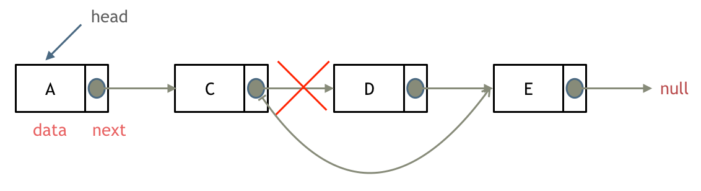

链表是一种通过指针串联在一起的线性结构，每一个节点由两部分组成，一个是数据域一个是指针域（存放指向下一个节点的指针），最后一个节点的指针域指向null（空指针的意思）。<br />链接的入口节点称为链表的头结点也就是head。 
# 链表的类型
## 单链表
单链表中的节点只能指向节点的下一个节点<br />
## 双链表
双链表：每一个节点有两个指针域，一个指向下一个节点，一个指向上一个节点。**双链表既可以向前查询也可以向后查询**。<br />如图所示： 
## 循环链表
循环链表，顾名思义，就是链表首尾相连。循环链表可以用来解决约瑟夫环问题。<br />
# 链表的存储方式
数组是在内存中是连续分布的，但是链表在内存中可不是连续分布的。<br />链表是通过指针域的指针链接在内存中各个节点。所以链表中的节点在内存中不是连续分布的 ，而是散乱分布在内存中的某地址上，分配机制取决于操作系统的内存管理。

如图所示：这个链表起始节点为2， 终止节点为7， 各个节点分布在内存个不同地址空间上，通过指针串联在一起。<br />
# 链表的操作
## 节点定义
```cpp
// 单链表
struct ListNode {
    int val;  // 节点上存储的元素
    ListNode *next;  // 指向下一个节点的指针
    ListNode(int x) : val(x), next(NULL) {}  // 节点的构造函数
};
```
## 删除节点
删除D节点，如图所示：<br />只要将C节点的next指针指向E节点就可以了。在C++里需要再手动释放这个D节点，释放这块内存。其他语言例如Java、Python，就有自己的内存回收机制，就不用自己手动释放了。
## 添加节点
添加F节点，如图所示：<br />
# 操作复杂度对比
把链表的特性和数组的特性进行一个对比，如图所示：

|  | **插入/删除的时间复杂度** | **查询的时间复杂度** | **适用场景** |
| --- | --- | --- | --- |
| **数组** | O(n) | O(1) | 数据量固定,频繁查找，较少增删 |
| **链表** | O(1) | O(n) | 数据量不固定，频繁增删，较少查询 |

