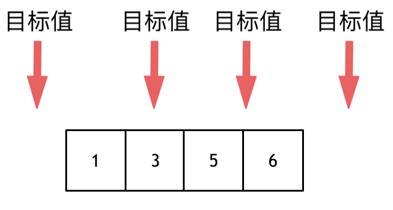
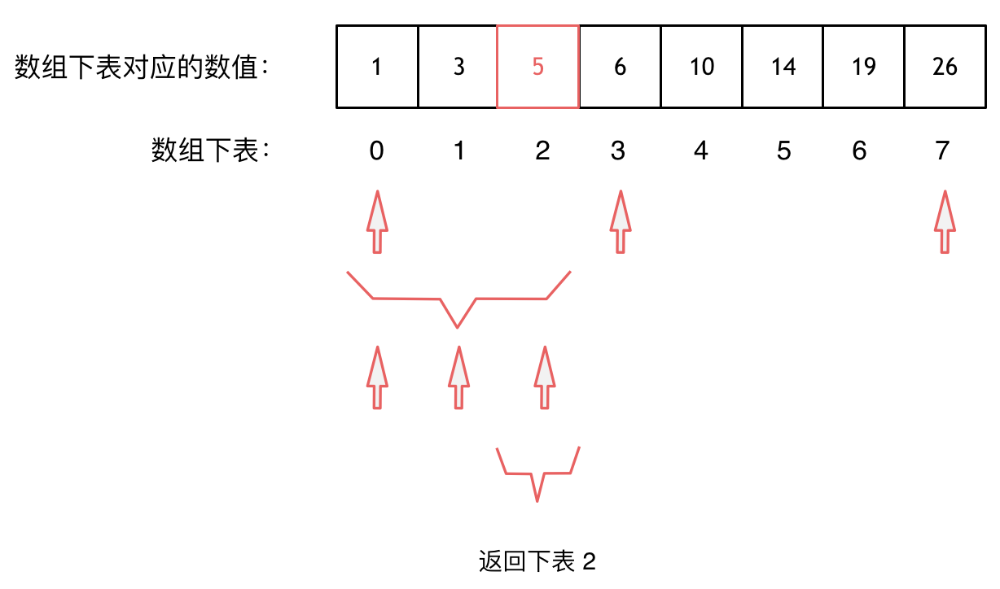

## 题目
[35 搜索插入位置](https://leetcode-cn.com/problems/search-insert-position/)<br />给定一个排序数组和一个目标值，在数组中找到目标值，并返回其索引。如果目标值不存在于数组中，返回它将会被按顺序插入的位置。<br />你可以假设数组中无重复元素。

示例 1:

- 输入: [1,3,5,6], 5
- 输出: 2

## 思路
这道题目，要在数组中插入目标值，无非是这四种情况。

- 目标值在数组所有元素之前
- 目标值等于数组中某一个元素
- 目标值插入数组中的位置
- 目标值在数组所有元素之后<br />

只要看到面试题里给出的数组是有序数组，都可以想一想是否可以使用二分法。同时题目还强调数组中无重复元素，因为一旦有重复元素，使用二分查找法返回的元素下标可能不是唯一的。

大体讲解一下二分法的思路，例如在这个数组中，使用二分法寻找元素为5的位置，并返回其下标:<br />
```cpp
class Solution {
public:
    int searchInsert(vector<int>& nums, int target) {
        int n = nums.size();
        int left = 0;
        int right = n - 1; // 定义target在左闭右闭的区间里，[left, right]
        while (left <= right) { // 当left==right，区间[left, right]依然有效
            int middle = left + ((right - left) >> 1);// 防止溢出 等同于(left + right)/2
            if (nums[middle] > target) {
                right = middle - 1; // target 在左区间，所以[left, middle - 1]
            } else if (nums[middle] < target) {
                left = middle + 1; // target 在右区间，所以[middle + 1, right]
            } else { // nums[middle] == target
                return middle;
            }
        }
        // 分别处理如下四种情况
        // 目标值在数组所有元素之前  [0, -1]
        // 目标值等于数组中某一个元素  return middle;
        // 目标值插入数组中的位置 [left, right]，return  right + 1
        // 目标值在数组所有元素之后的情况 [left, right]， return right + 1
        return right + 1;
    }
};
```
