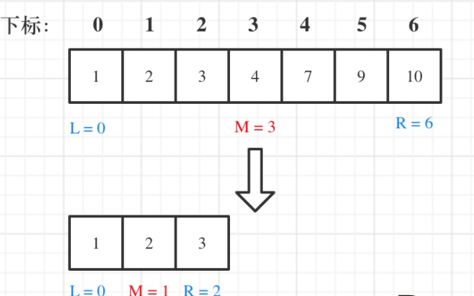
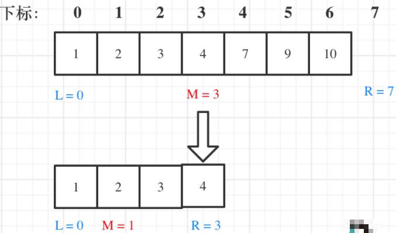

写二分法经常写乱，主要是因为对区间的定义没有想清楚，区间的定义就是不变量。要在二分查找的过程中，保持不变量，就是**在while寻找中每一次边界的处理都要坚持根据区间的定义来操作，这就是循环不变量规则**。 写二分法，**区间的定义一般为两种，左闭右闭即[left, right]，或者左闭右开即[left, right)**。区间的定义这就决定了二分法的代码应该如何写.
## 左闭右闭[left, right]

- `while (left <= right)`要**使用<=** ，因为left == right在区间[left, right]是有意义的
- `if (nums[middle] > target)`, **right要赋值为middle - 1**，因为当前这个nums[middle]一定不是target，那么接下来要查找的左区间结束下标位置就是middle - 1 

## 左闭右开[left, right)

- `while (left < right)`要**使用<** ,因为left == right在区间[left, right)是没有意义的
- `if (nums[middle] > target)`, **right要赋值为middle**，因为当前nums[middle]不等于target，去左区间继续寻找，而寻找区间是左闭右开区间，所以right更新为middle，即下一个查询区间不会去比较nums[middle] 
