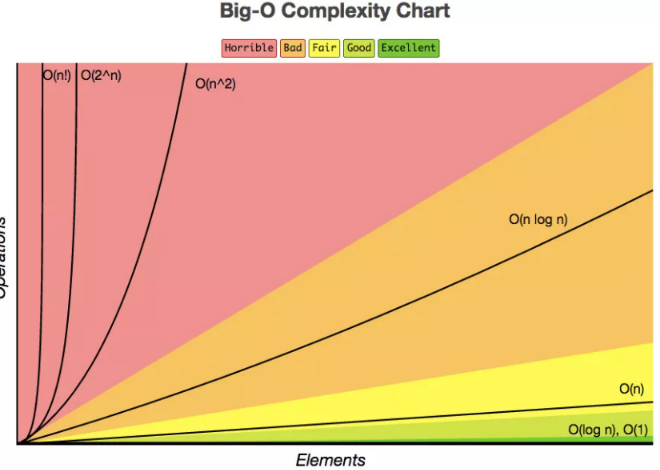

如何去衡量不同算法之间的优劣呢？主要还是从算法所占用的「时间」和「空间」两个维度去考量。

- **时间维度**：是指执行当前算法所消耗的时间，我们通常用「时间复杂度」来描述。
- **空间维度**：是指执行当前算法需要占用多少内存空间，我们通常用「空间复杂度」来描述。
# 时间复杂度
大O符号表示法，即 `T(n) = O(f(n))`。<br />其中n表示数据规模 ，O(f(n))表示运行算法所需要执行的指令数，和f(n)成正比。
## 复杂度排行
常见的复杂度等级如下：`O(1)常数阶 < O(\log n)对数阶 < O(n)线性阶 < O(n^2)平方阶 < O(n^3)立方阶 < O(2^n)指数阶 < O(n!)`<br />
## 常数阶O(1)
无论代码执行了多少行，其他区域不会影响到操作，比如:
```c
void swapTwoInts(int &a, int &b){
    int temp = a;
    a = b;
    b = temp;
}
```
## 线性阶O(n)
在下面这段代码，for循环里面的代码会执行 n 遍，因此它消耗的时间是随着 n 的变化而变化的:
```c
int sum (int n){
    int ret = 0;
    for (int i = 0 ; i <= n ; i++){
       ret += i;
    }
    return ret;
}
```
## 平方阶O(n²)
当存在双重循环的时候，即把`O(n)`的代码再嵌套循环一遍，它的时间复杂度就是`O(n²)`了:
```c
void selectionSort(int arr[], int n){
    for(int i = 0; i < n ; i++){
      int minIndex = i;
      for (int j = i + 1; j < n ; j++ )
        if (arr[j] < arr[minIndex])
            minIndex = j;
 
      swap ( arr[i], arr[minIndex]);
    }
}
```

当然，双循环并不完全是`O(n²)`，如果某一层循环不需要循环到n，到某个值停止，那复杂度就变成了`O(n*m)`。
## 对数阶O(logn)
比如，在二分查找法的代码中，通过while循环，**成2倍数的缩减搜索范围**，也就是说需要经过 `log2^n`次即可跳出循环。
## 线性对数阶O(nlogn)
将时间复杂度为O(logn)的代码循环N遍的话，那么它的时间复杂度就是`n * O(logn)`，也就是了`O(nlogn)`。
