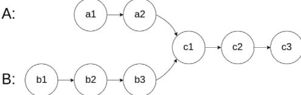
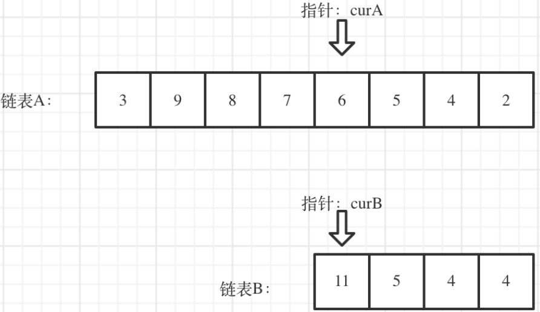

## 题目
[面试题02.07](https://leetcode-cn.com/problems/intersection-of-two-linked-lists-lcci/)
给你两个单链表的头节点 headA 和 headB ，请你找出并返回两个单链表相交的起始节点。如果两个链表没有交点，返回 null 。
图示两个链表在节点 c1 开始相交：


## 思路
求两个链表交点节点的**指针**，要注意，交点不是数值相等，而是**指针相等（指针指向同一地址）**。

两个链表从某一位置开始到末尾完全相同，如果两个链表长度不一致，那么较长的链表前面多出来的部分一定是多余的。所以可以先将多部部分去掉，**问题就变成了两个等长链表同时遍历找相同指针的问题**。
求出两个链表的长度，并求出两个链表长度的差值，然后让curA移动到，和curB 末尾对齐的位置。

```cpp
class Solution
{
public:
    ListNode *getIntersectionNode(ListNode *headA, ListNode *headB)
    {
        //求两个链表的长度
        int sizeA = 0, sizeB = 0;
        ListNode *nodeA = headA, *nodeB = headB;
        while (nodeA != nullptr)
        {
            sizeA++;
            nodeA = nodeA->next;
        }
        while (nodeB != nullptr)
        {
            sizeB++;
            nodeB = nodeB->next;
        }

        nodeA = headA;
        nodeB = headB;

        //长度较长的链表移动 gap 步，使两链表尾部对齐
        int gap = sizeA - sizeB;
        if (sizeA > sizeB)
        {
            int gap = sizeA - sizeB;
            while (nodeA != nullptr && gap > 0)
            {
                nodeA = nodeA->next;
                gap--;
            }
        }
        else
        {
            int gap = sizeB - sizeA;
            while (nodeB != nullptr && gap > 0)
            {
                nodeB = nodeB->next;
                gap--;
            }
        }
        //长度较长的链表移动 gap 步，使两链表尾部对其
        while (nodeA != nullptr)
        {
            if (nodeA == nodeB)
                return nodeA;
            nodeA = nodeA->next;
            nodeB = nodeB->next;
        }
        return nullptr;
    }
};
```
