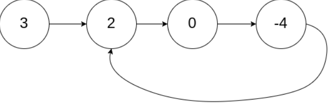

## 题目
[142 环形链表II](https://leetcode-cn.com/problems/linked-list-cycle-ii/solution/huan-xing-lian-biao-ii-by-leetcode-solution/)
给定一个链表的头节点  head ，返回链表开始入环的第一个节点。 如果链表无环，则返回 null。如果链表中有某个节点，可以通过连续跟踪 next 指针再次到达，则链表中存在环。

示例：
**输入：**head = [3,2,0,-4], pos = 1
**输出：**返回索引为 1 的链表节点
**解释：**链表中有一个环，其尾部连接到第二个节点。

## 思路
### 直观解法
一个非常直观的思路是：我们遍历链表中的每个节点，并将它记录下来；一旦遇到了此前遍历过的节点，就可以判定链表中存在环。此过程中并不需要排序，所以借助哈希表`unordered_set`可以很方便地实现。
```cpp
class Solution
{
public:
    ListNode *detectCycle(ListNode *head)
    {
        std::unordered_set<ListNode *> storedNode;
        ListNode *node = head;
        while (node != nullptr)
        {
            auto search = storedNode.find(node);
            if (search != storedNode.end())
            {
                return node;
            }
            storedNode.insert(node);
            node = node->next;
        }
        return nullptr;
    }
};
```
### 双指针法
使用两个指针，fast 与 slow。它们起始都位于链表的头部。随后，slow 指针每次向后移动一个位置，而fast 指针向后移动两个位置。
fast会先进入环，并一直处于环中，slow后进入环一定会与fast相遇。如果链表中存在环，fast 指针最终将再次与 slow 指针在环中相遇。
当发现 slow 与 fast 相遇时，我们再额外使用一个指针ptr。起始，它指向链表头部；随后，它和 slow 每次向后移动一个位置。最终，**它们会在入环点相遇。**

```cpp
class Solution
{
public:
    ListNode *detectCycle(ListNode *head)
    {
        ListNode *slow = head, *fast = head;
        while (fast != nullptr)
        {
            slow = slow->next;
            if (fast->next == nullptr)
            {
                return nullptr;
            }
            fast = fast->next->next;
            // fast与slow相遇
            if (fast == slow)
            {
                ListNode *ptr = head;
                while (ptr != slow)
                {
                    ptr = ptr->next;
                    slow = slow->next;
                }
                return ptr;
            }
        }
        return nullptr;
    }
};
```

