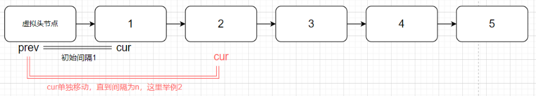

## 题目
[19 删除链表的倒数第N个节点](https://leetcode-cn.com/problems/remove-nth-node-from-end-of-list/)
给你一个链表，删除链表的倒数第 n 个结点，并且返回链表的头结点
输入：head = [1,2,3,4,5], n = 2 输出：[1,2,3,5] 示例 2：
输入：head = [1], n = 1 输出：[] 示例 3：
输入：head = [1,2], n = 1 输出：[1]
## 思路
又是要求在原链表上进行增删操作，优先考虑**双指针法**。
如果要删除倒数第n个节点，让fast先移动n步，然后让fast和slow同时移动，直到fast指向链表末尾，之后删掉slow所指向的节点就可以了。

- 设置初始位置后,先移动fast指针，直到两个节点的间隔为n



- 之后一起移动两个指针，直到fast到达末尾


```cpp
class Solution
{
public:
    ListNode *removeNthFromEnd(ListNode *head, int n)
    {
        ListNode *newHead = new ListNode(0, head);
        ListNode *prev = newHead, *cur = head;
        int step = 1; // prev和cur的间隔
        while (cur->next != nullptr)
        {
            if (step == n)
            {
                prev = prev->next;
            }
            else
            {
                step++;
            }
            cur = cur->next;
        }
        ListNode* tmp = prev->next;
        prev->next = prev->next->next;
        delete tmp;
        return newHead->next;
    }
};
```
