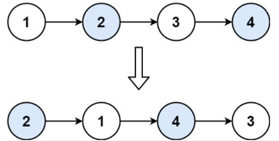
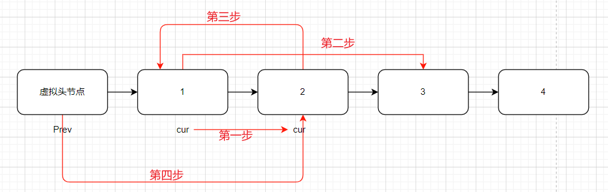
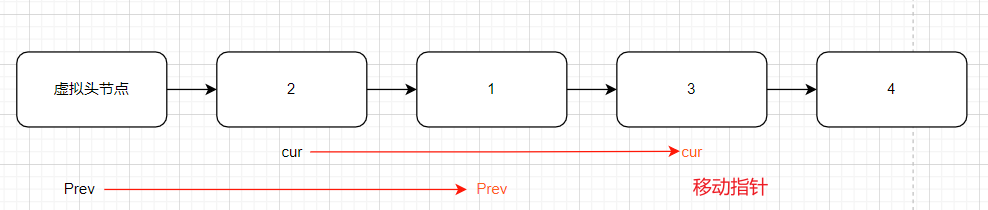

## 题目
[24 两两交换链表的节点](https://leetcode-cn.com/problems/swap-nodes-in-pairs/submissions/)
给定一个链表，两两交换其中相邻的节点，并返回交换后的链表。
你不能只是单纯的改变节点内部的值，而是需要实际的进行节点交换。


# 思路
又是原地变换链表，优先考虑**双指针法**。当然也建议加上**虚拟头节点**，使代码更统一不用做区分了。
接下来就是交换相邻两个元素了，**此时一定要画图，不画图，操作多个指针很容易乱，而且要记住操作的先后顺序。**


```cpp
class Solution
{
public:
    ListNode *swapPairs(ListNode *head)
    {
        ListNode *newHead = new ListNode(0, head);
        ListNode *prev = newHead, *cur = head;
        while (cur != nullptr && cur->next != nullptr)
        {
            //变换位置的四个步骤
            cur = cur->next;
            prev->next->next = cur->next;
            cur->next = prev->next;
            prev->next = cur;
			// cur和prev移动两位，准备下一轮交换
            cur = cur->next->next;
            prev = prev->next->next;
        }
        ListNode *tmp = newHead->next;
        delete newHead;//删除临时内存
        return tmp;
    }
};
```
