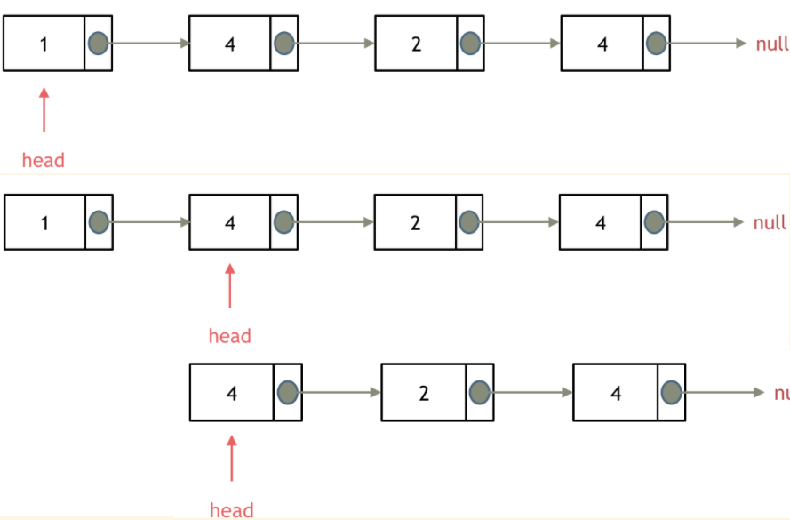
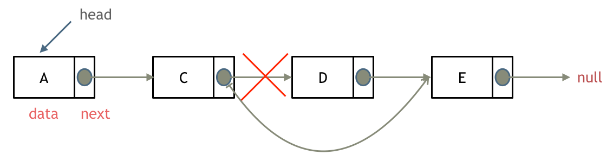
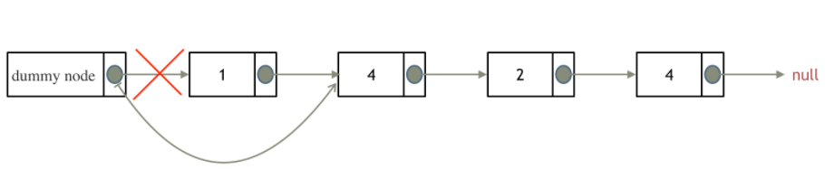

因为单链表的特殊性，只能指向下一个节点，因此在删除和添加节点的操作时，对头节点的操作与其他中间节点不一样，需要单独处理。

以删除节点为例，操作区别为：

- 删除头节点：
   - head移动到head->next
   - 释放原head的内存
   - 循环处理头节点直到链表结束（与中间节点的循环分开，两个循环）

- 删除中间节点：
   - 前一节点next指向当前节点的next
   - 释放当前节点的内存
   - 循环处理中间节点直到链表结束

所以一个删除节点的操作，我们需要两个循环来分别处理两者情况，添加节点同理。

那么我们可以添加一个**虚拟头节点**，这样真正的头节点就变成了一个中间节点，这样就可以用一个循环完成处理，不需要单独区分头节点的处理。**需要注意的是，处理链表返回时一定要返回真正的头节点，并删除虚拟头节点**。

